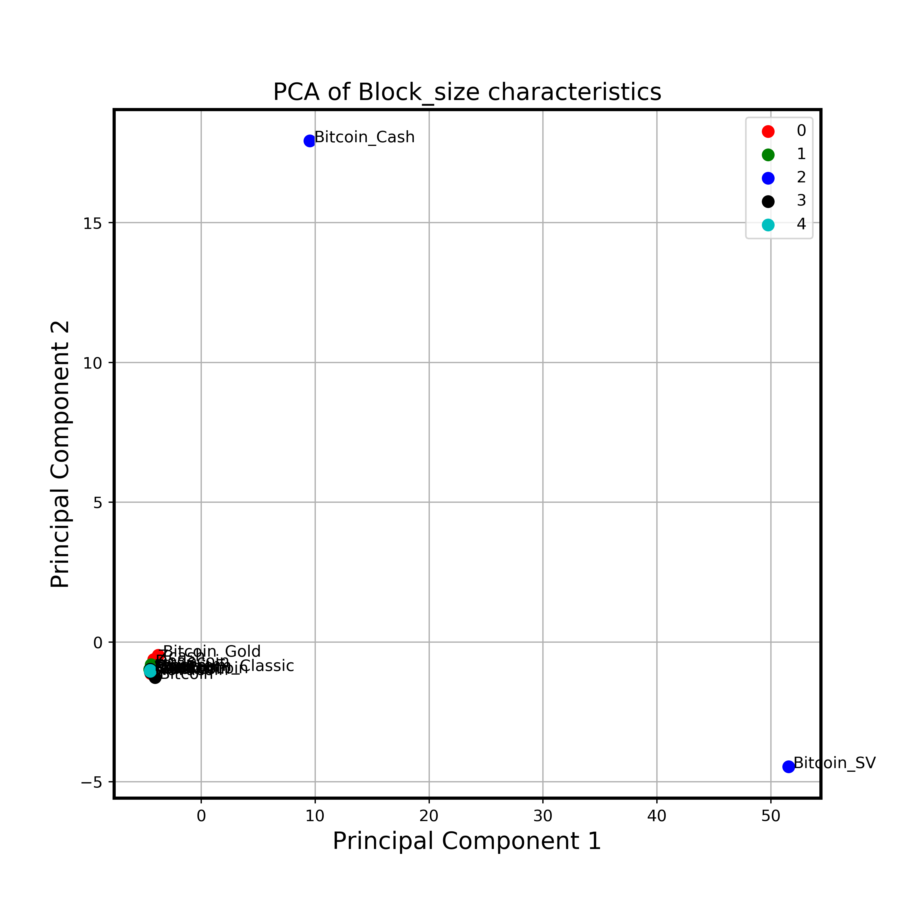
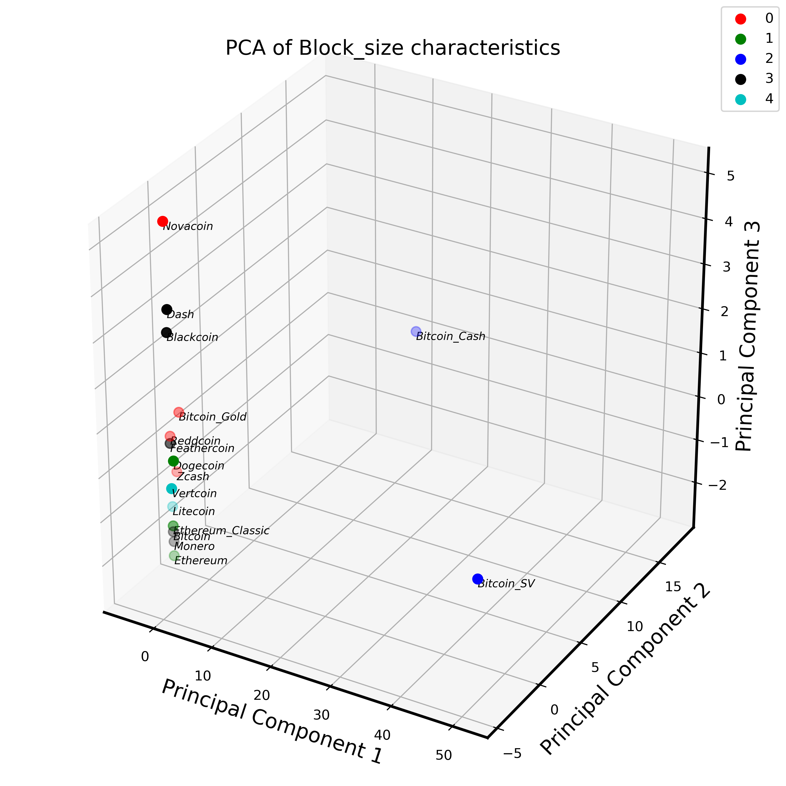
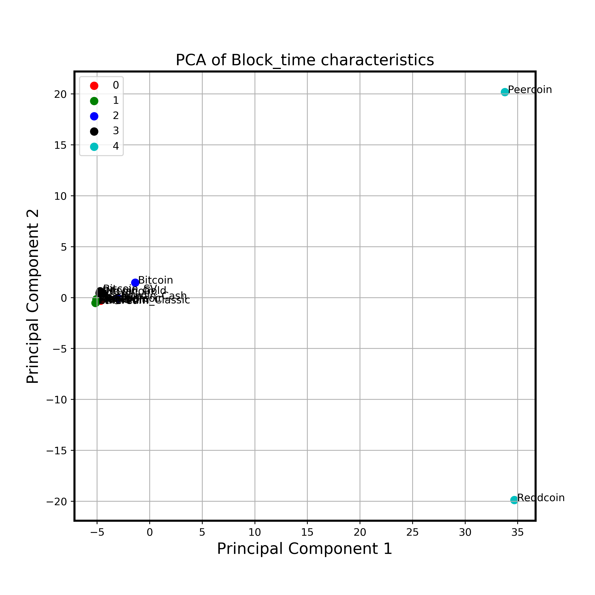
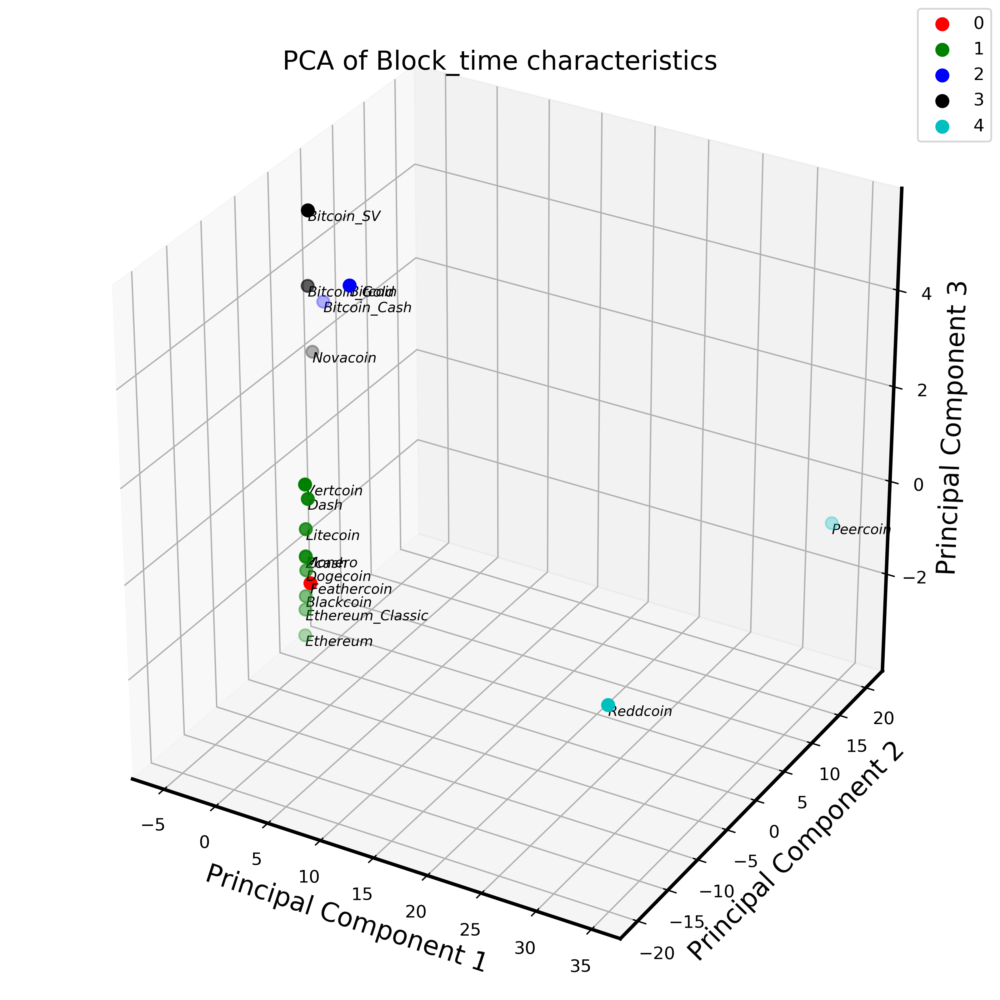
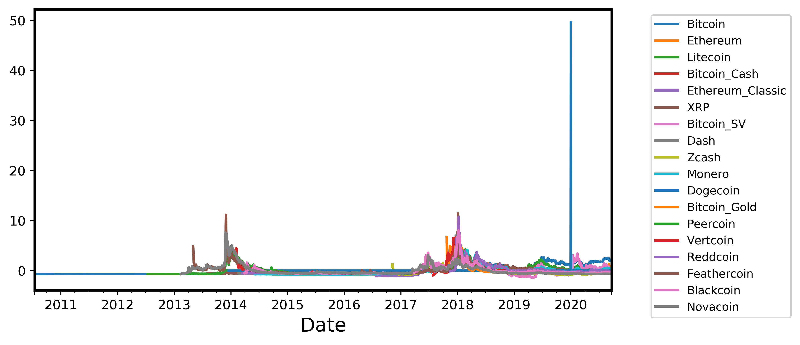
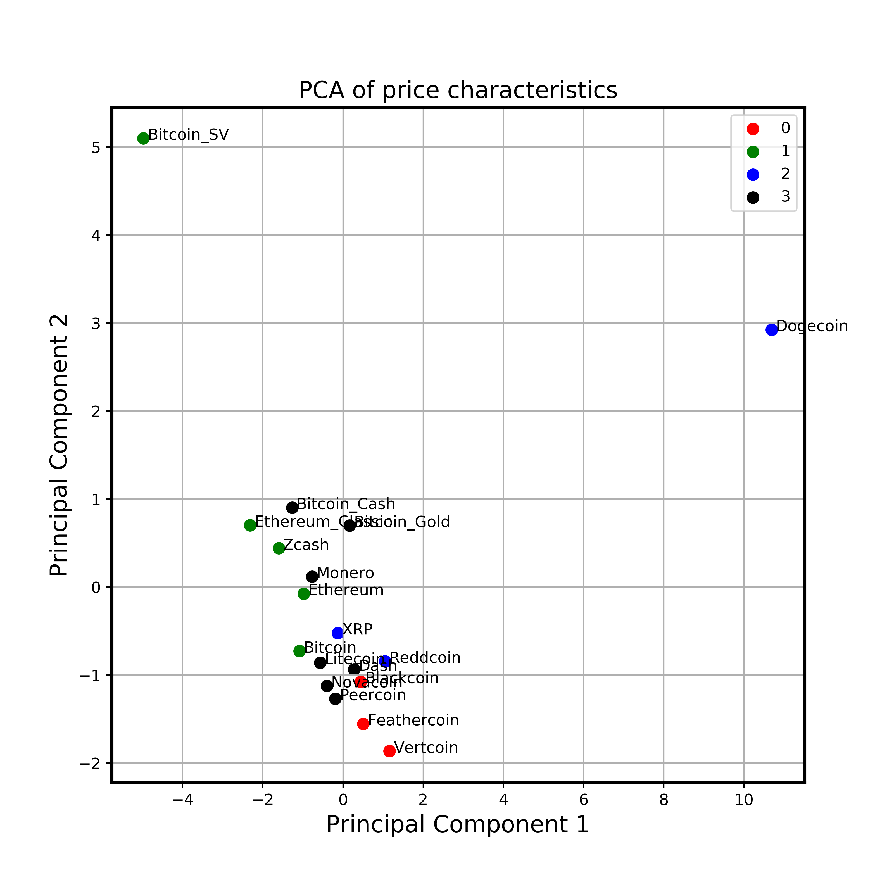
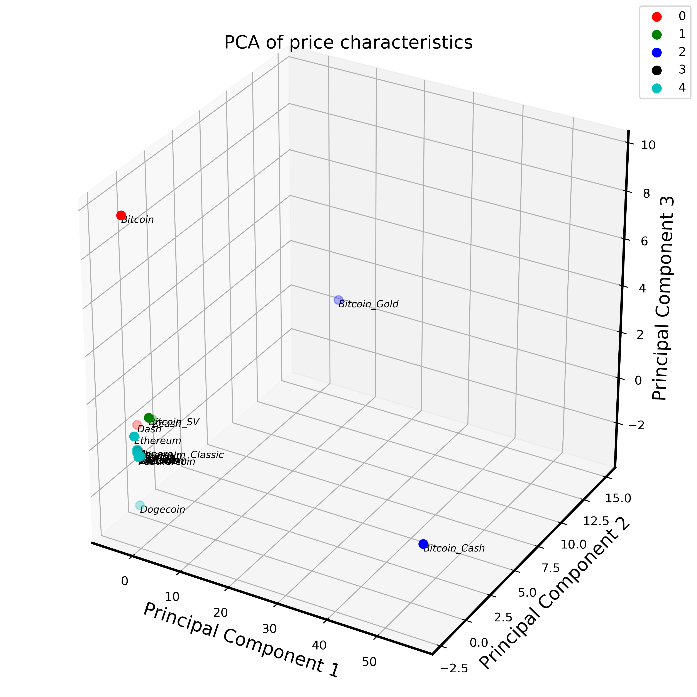

[](http://quantlet.de/)

## [](http://quantlet.de/) **Blockchain_mechanism_clustering** [](http://quantlet.de/)

```yaml

Name of Quantlet: Blockchain_mechanism_clustering
Published in: ' Advances in Quantitative Analysis of Finance & Accounting (AQAFA)'


Description: 'Use distributional characteristics such as fourier power spectrum, moments, quantiles, global we optimums, as well as the measures for long term dependencies, risk and noise to summarise the information from crypto time series and conduct clustering via spectral clustering'

Keywords : 'Cryptocurrency, Blockchain mechanism , Distributional characteristics, Clustering, Box plot'

Author: Kainat Khowaja , Min-Bin Lin,
Submitted: Mon., Jan. 11 2020 by Kainat Khowaja


```















### [IPYNB Code: Blockchain_mechanism_clustering.ipynb](Blockchain_mechanism_clustering.ipynb)


automatically created on 2021-04-23