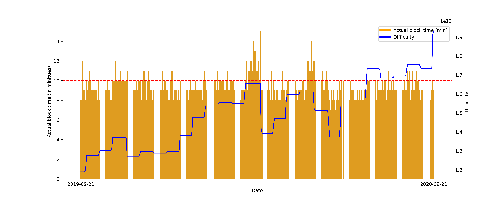

[](http://quantlet.de/)

## [](http://quantlet.de/) **Blockchain_mechanism_plotting** [](http://quantlet.de/)

```yaml

Name of Quantlet: Blockchain_mechanism_plotting
Published in: ' Advances in Quantitative Analysis of Finance & Accounting (AQAFA)'


Description: 'Use distributional characteristics such as fourier power spectrum, moments, quantiles, global we optimums, as well as the measures for long term dependencies, risk and noise to summarise the information from crypto time series and conduct clustering via spectral clustering'

Keywords : 'Cryptocurrency, Blockchain mechanism , Distributional characteristics, Clustering, Box plot'

Author: Kainat Khowaja , Min-Bin Lin,
Submitted: Mon., Jan. 11 2020 by Kainat Khowaja


```




### PYTHON Code
```python

# import all required packages
from matplotlib.lines import Line2D
import seaborn as sns
import pandas as pd

import matplotlib.pyplot as plt
from matplotlib.lines import Line2D

import os
import glob
from functools import reduce


# define a method to extract data for a given crypto
def get_crypto(crypto, df_list, col_names):
    """
    :param col_names: all parameters
    :param crypto: name of the crypto
    :param df_list: a list of dataframes
    :return: dataframe for the given crypto
    """
    crypto_dfs = []
    for i in range(len(df_list)):
        crypto_df = df_list[i][['Date', crypto]]
        crypto_dfs.append(crypto_df)
    merged_crypto_df = reduce(lambda left, right: pd.merge(left, right, on=['Date'],
                                                           how='outer'), crypto_dfs)
    # make date as index
    merged_crypto_df.set_index('Date', inplace=True)
    # col names
    merged_crypto_df.columns = col_names
    return merged_crypto_df


# define a method for plotting time series heat map
def time_heatmap(data, names, colors, plot_title):
    """
    :param data: dataframe
    :param names: list of crypto names
    :param colors: \text
    :param plot_title: \text
    :return: figure
    """
    date = np.array(data.index)
    z = np.array(data.T)
    fig = go.Figure(data=go.Heatmap(
        z=z,
        x=date,
        y=names,
        colorscale=colors))
    fig.update_layout(
        title={
            'text': plot_title,
            'y': 0.95,
            'x': 0.5,
            'xanchor': 'center',
            'yanchor': 'top'},
        xaxis_title="Date",
        yaxis_title="Cryptocurrency",
        xaxis_nticks=11,
        font=dict(size=18))
    return fig

# boxplot "horizontal" (1*18)
def horizontal_boxplot (data, startTime, endTime):
    """
    :param data: dataframe
    :param startTime: \text date "YYYY-MM-DD"
    :param endTime: \text date "YYYY-MM-DD"
    :return: figure
    """
    # refine the data
    # extract data by desired 
    df = data[~(data['Date'] < startTime)]
    df = df[~(df['Date'] > endTime)]
    # get rid of data col
    date = df['Date']
    df = (df.loc[:, df.columns != 'Date'])
    # handle na and data type
    df = df.fillna(0)
    df = df.astype(int)
    # take log 
    df = df.replace([np.inf, -np.inf], 0)
    # #df = np.log(df).replace(-np.inf, 0)
    # # df = df.apply(lambda x: x/1000000)
    # plotting
    # melt the dataframe
    mdf = df.melt(var_name='Cryptocurrency',value_name='Block time in min')
    # set  figure layout
    fig,ax = plt.subplots(figsize=(20,6))
    ax = sns.boxplot(x="Cryptocurrency", y='Block time in min', data=mdf, color='white', width=0.3)
    # iterate over boxes
    for i,box in enumerate(ax.artists):
        box.set_edgecolor('black')
        box.set_facecolor('white')
    # iterate over whiskers and median lines
    for j in range(6*i,6*(i+1)):
         ax.lines[j].set_color('black')
    plt.tight_layout()
    return fig
    # plt.savefig('boxplot_ver.png', transparent=False, dpi=500)

# boxplot "vertical" (3*6)
def vertical_boxplot (data, startTime, endTime, n_rows, n_cols):
    """
    :param data: dataframe
    :param startTime: \text date "YYYY-MM-DD"
    :param endTime: \text date "YYYY-MM-DD"
    :return: figure
    """
    # refine the data
    # extract data by desired
    df = data[~(data['Date'] < startTime)]
    df = df[~(df['Date'] > endTime)]
    # get rid of data col
    date = df['Date']
    df = (df.loc[:, df.columns != 'Date'])
    # handle na and data type
    df = df.fillna(0)
    df = df.astype(int)
    # take log 
    df = df.replace([np.inf, -np.inf], 0)
    # set up figure layout
    count = 0
    col_num = 0
    n_rows = n_rows
    n_cols = n_cols
    sns.set(font_scale=0.5)
    # plotting
    plt.subplots(n_rows, n_cols)
    # marker style
    red_diamond = dict(markerfacecolor='r', marker='D')
    # interate over
    for i in range(n_rows):
        for j in range(n_cols):
            plt.subplot(n_rows, n_cols, count+1)
            sns.boxplot(df.iloc[:, col_num], orient='vertical', flierprops=red_diamond, linewidth=1.5)
            if col_num < df.shape[1]:
                count += 1
                col_num += 1
    plt.tight_layout()
    plt.subplots_adjust(wspace=1)
    # plt.savefig('boxplot_36.png', transparent=False, dpi=500)
    return fig

# data loading
# name reference
crypto_names = ['Bitcoin',
                'Ethereum',
                'Litecoin',
                'Bitcoin Cash',
                'Ethereum Classic',
                'XRP',
                'Bitcoin SV',
                'Dash',
                'Zcash',
                'Monero',
                'Dogecoin',
                'Bitcoin Gold',
                'Peercoin',
                'Vertcoin',
                'Reddcoin',
                'Feathercoin',
                'Blackcoin',
                'Novacoin']

# path to the directory of the all csv files
all_files = glob.glob(os.path.join('data', '*.csv'))

# file (parameter) names
name_list = []
for name in sorted(os.listdir('./data/')):
    if name.endswith('.csv'):
        name = name.replace('.csv', '')
        name_list.append(name)

# load data (day-based): list of dataframes (each dataframe for each variable)
dfs = []
for file, i in zip(sorted(all_files), range(len(name_list))):
    df = pd.read_csv(file)
    # give name attribute for each dataframe in the list
    df.name = name_list[i]
    dfs.append(df)

name_list = ['Active address',
             'Block size',
             'Block time',
             'Difficulty',
             'GTrends',
             'Hash rate',
             'Market cap',
             'Med. transaction fee',
             'Med. transaction value',
             'Sent from addresses',
             'Price',
             'Mining profitability',
             'Fee in reward',
             'Sent coins',
             'Top100ToTotal',
             'Avg. transaction fee',
             'Avg. transaction value',
             'Transaction',
             'Tweets']

```

automatically created on 2021-04-23